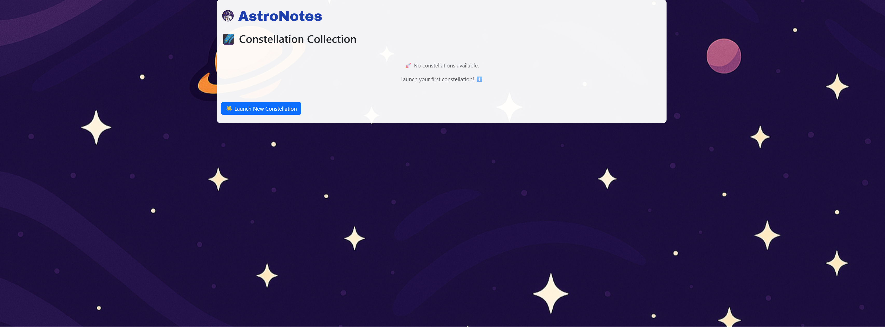
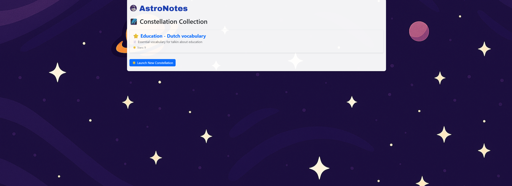
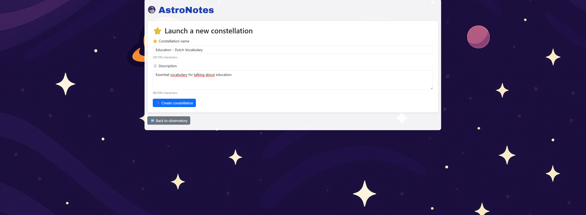
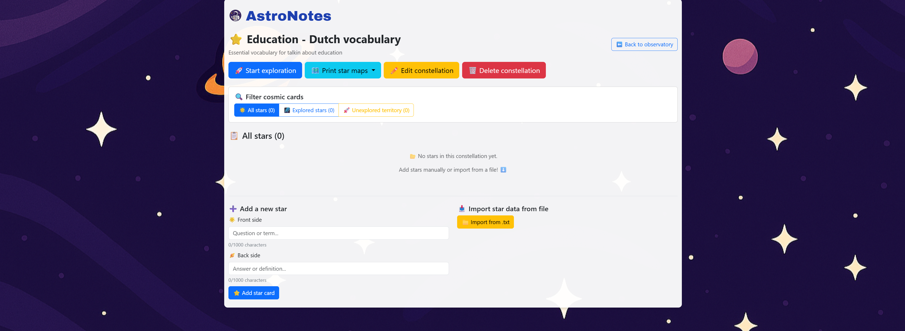
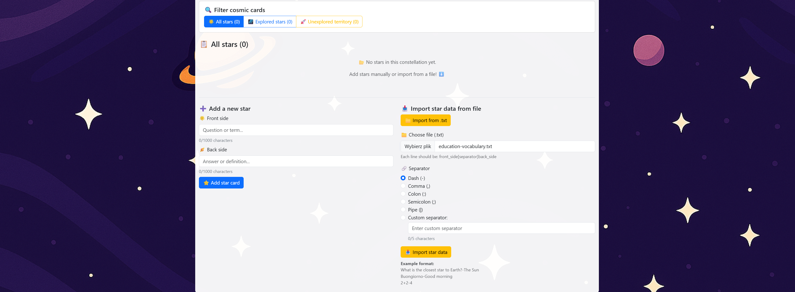
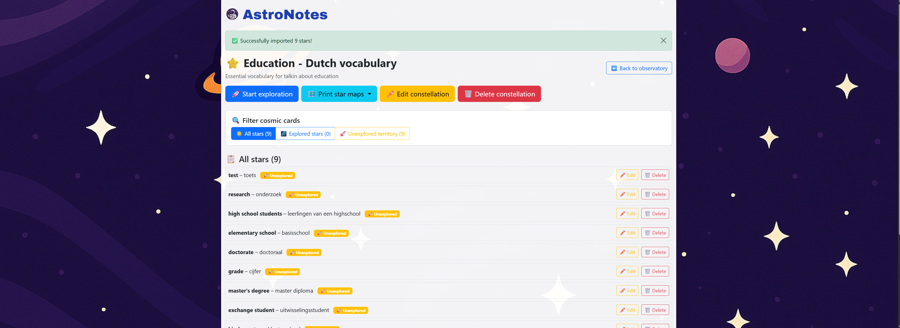
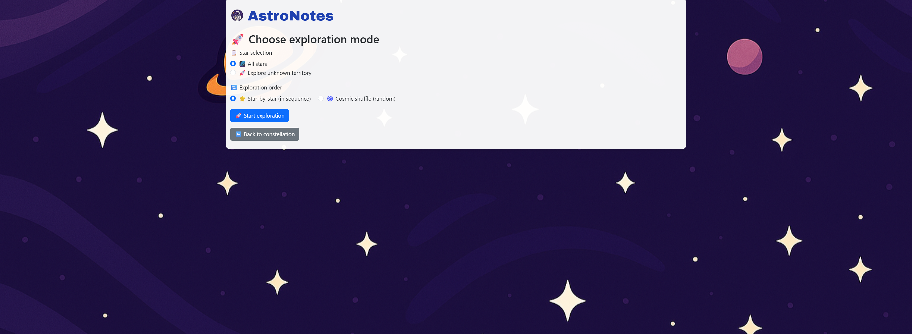
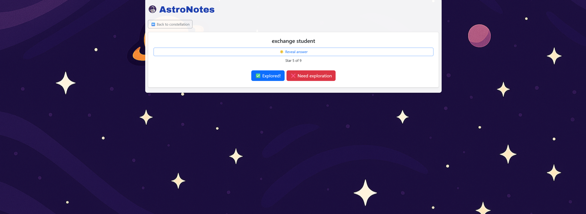
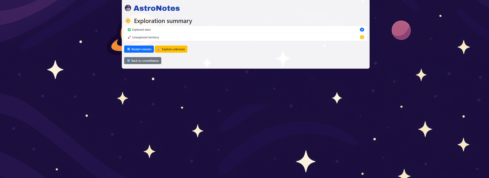
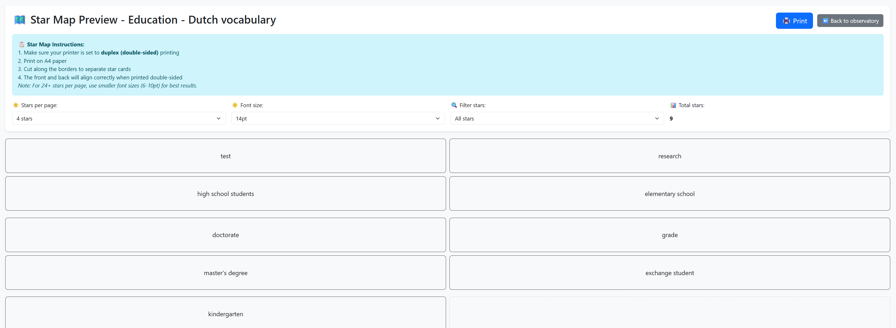

# AstroNotes - Flashcard Learning Application
--------------------------------------------------

AstroNotes is a web-based flashcard application built with Flask, inspired by
the cosmos. Flashcard sets are called "constellations" and individual cards are
called "stars", giving the whole experience a space-exploration theme.

--------------------------------------------------
## TABLE OF CONTENTS
--------------------------------------------------
1. Features
2. Tech Stack
3. Project Structure
4. Installation & Setup
5. Usage Guide
6. Screenshots
7. Database Models
8. File Import Format
9. Print Feature

--------------------------------------------------
## 1. FEATURES
--------------------------------------------------

- Create and manage flashcard sets (constellations)
- Add, edit, and delete individual flashcards (stars)
- Import flashcards in bulk from .txt files with customizable separators
- Study mode with two options:
    - Sequential (star-by-star in order)
    - Cosmic shuffle (random order)
- Filter cards to study: all cards or only unknown (unexplored) ones
- Track progress: mark each card as "Explored" or "Need exploration"
- Session summary after each study round
- Print flashcards as a physical star map (duplex-ready, A4 format)
    - Configurable cards per page: 2, 4, 6, 8, 9, 12, 24, or 32
    - Configurable font size (6pt - 24pt)
    - Filter print output: all, known, or unknown cards only
- Character counters on input fields
- Dismissible flash notifications for all user actions

--------------------------------------------------
## 2. TECH STACK
--------------------------------------------------

Backend:
  - Python 3
  - Flask
  - Flask-SQLAlchemy (ORM)
  - Flask-WTF (form validation + CSRF protection)
  - Werkzeug
  - python-dotenv

Frontend:
  - Jinja2 templating
  - Bootstrap 5.3
  - Google Fonts (Archivo Black)
  - Vanilla JavaScript (character counters, modal handling)

Database:
  - SQLite (via SQLAlchemy)

--------------------------------------------------
## 3. PROJECT STRUCTURE
--------------------------------------------------
```
ASTRONOTES_APP/
├── astronotes/
│   ├── instance/
│   │   └── db.sqlite3              # SQLite database (auto-created)
│   ├── screenshots/                # App screenshots for documentation
│   ├── static/
│   │   ├── background.png          # Background image
│   │   └── logo.png                # App logo
│   ├── templates/
│   │   ├── base.html               # Base layout (navbar, flash messages)
│   │   ├── index.html              # Homepage - list of constellations
│   │   ├── add_set.html            # Form to create a new constellation
│   │   ├── view_set.html           # Set detail view, add/edit/delete cards
│   │   ├── learn_mode.html         # Study mode selection screen
│   │   ├── learn_flashcard.html    # Individual flashcard study screen
│   │   ├── learn_summary.html      # End-of-session summary
│   │   └── print_cards.html        # Print preview and controls
│   ├── app.py                      # Main Flask app and all routes
│   ├── forms.py                    # WTForms form definitions
│   ├── models.py                   # SQLAlchemy database models
│   ├── init_db.py                  # Script to initialize the database
│   └── requirements.txt            # Python dependencies
├── .env.key                        # Environment variables (SECRET_KEY)
└── .gitignore
```
--------------------------------------------------
## 4. INSTALLATION & SETUP
--------------------------------------------------

Prerequisites:
  - Python 3.8+
  - pip

Steps:

1. Clone the repository:
```
   git clone https://github.com/Kaskra13/astronotes
   cd astronotes
```
2. Create and activate a virtual environment:
```
   python -m venv venv
```
   Windows:```
     venv\Scripts ctivate```

   macOS/Linux:```
     source venv/bin/activate```

3. Install dependencies:
```
   pip install -r requirements.txt
```
4. Set up environment variables:
   Create a .env file in the project root with the following content:
```
   SECRET_KEY=your-secret-key-here
```
5. Initialize the database (optional, app auto-creates tables on first run):
```
   python init_db.py
```
6. Run the application:
```
   python app.py
```
7. Open your browser and navigate to:

   http://127.0.0.1:5000

--------------------------------------------------
## 5. USAGE GUIDE
--------------------------------------------------

Creating a Constellation (Flashcard Set):
  - From the home page, click "Launch New Constellation"
  - Enter a name (max 100 characters) and optional description (max 500 chars)
  - Click "Create constellation"

Adding Stars (Flashcards):
  - Open a constellation from the home page
  - Scroll to "Add a new star" at the bottom of the set view
  - Enter the front side (question/term) and back side (answer/definition)
  - Click "Add star card"

Importing Stars from File:
  - In a set view, click "Import from .txt" to expand the import section
  - Upload a .txt file and select your separator character
  - See section 8 (File Import Format) for file structure details

Studying (Exploration Mode):
  - Click "Start exploration" from a set view
  - Choose your exploration order (sequential or random)
  - Choose your subset (all stars or unexplored only)
  - Click "Start exploration"
  - For each card, click "Reveal answer", then mark as Explored or Need Exploration
  - Review your summary at the end of each session

Printing Star Maps:
  - From a set view, click "Print star maps" and select a filter
  - Adjust cards per page and font size in the print preview
  - Ensure duplex (double-sided) printing is enabled in your printer settings
  - Cards are arranged so front and back align correctly when printed double-sided

--------------------------------------------------
## 6. SCREENSHOTS
--------------------------------------------------



Home page showing the Constellation Collection (empty state).
Place here to illustrate the starting screen of the app.


Home page with constellation already created.
Place here to show how sets appear in the list.


The "Launch a new constellation" form.
Place here to illustrate how to create a new flashcard set.


The set detail view showing flashcards and action buttons.
Place here to show the main interface for managing a set.


The import panel expanded inside the set view.
Place here to demonstrate the bulk import feature.


The set view after flashcards have been added.
Place here to show what a populated constellation looks like.


The exploration mode selection screen.
Place here to illustrate study settings (sequential/random, all/unknown).


A single flashcard during an exploration session.
Place here to show the study interface with reveal button and progress counter.


The exploration summary screen after completing a session.
Place here to show the known/unknown stats and restart options.


The print preview (Star Map) screen with layout controls.
Place here to illustrate the physical flashcard printing feature.

--------------------------------------------------
## 7. DATABASE MODELS
--------------------------------------------------

FlashcardSet (constellation):
  - id: Integer, primary key
  - name: String(100), required
  - description: String(500), optional
  - flashcards: Relationship to Flashcard (one-to-many)

Flashcard (star):
  - id: Integer, primary key
  - front: String(1000), required - question or term
  - back: String(1000), required - answer or definition
  - category: String(20), default 'unknown' - tracks 'known' or 'unknown'
  - set_id: Integer, foreign key -> flashcard_set.id

--------------------------------------------------
## 8. FILE IMPORT FORMAT
--------------------------------------------------

Flashcards can be imported from a plain .txt file.
Each line must follow the format:

  front_side[separator]back_side

Supported separators: - , : ; | or any custom string (max 5 chars)

Example using dash separator (-):
```
  What is the closest star to Earth?-The Sun
  Buongiorno-Good morning
  2+2-4
```
Rules:
  - One flashcard per line
  - Empty lines are skipped
  - Lines missing the separator are reported as errors but do not stop import
  - The separator splits only on the FIRST occurrence (split with maxsplit=1)
  - File must be UTF-8 encoded

--------------------------------------------------
## 9. PRINT FEATURE
--------------------------------------------------

AstroNotes supports printing physical flashcards in duplex (double-sided) mode.

Configuration options:
  - Stars per page: 2, 4, 6, 8, 9, 12, 24, or 32
  - Font size: 6pt to 24pt (10 options)
  - Filter: All stars / Explored / Unexplored

Printing instructions:
  1. Select your preferred layout in the print preview
  2. Enable duplex printing in your printer settings
  3. Print on A4 paper
  4. Cut along card borders to separate individual cards
  5. Front and back sides are automatically mirrored for correct duplex alignment

Tip: For 24+ cards per page, use font sizes between 6pt and 10pt.
